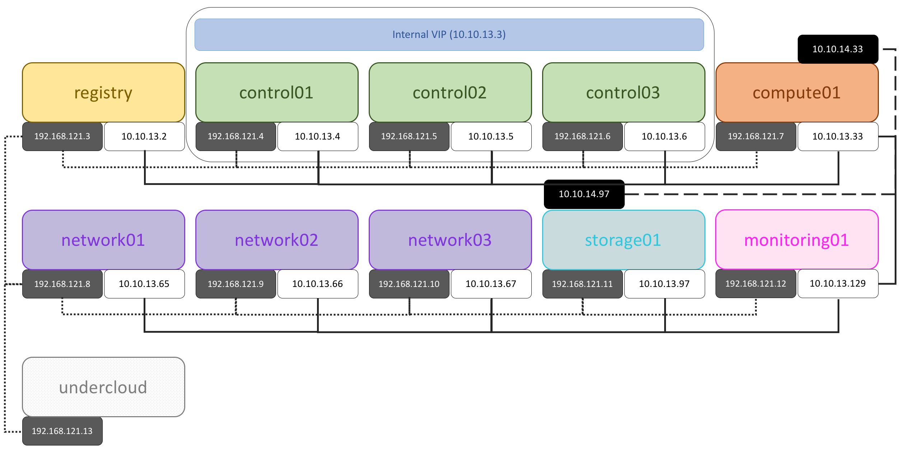

# OpenStack Multi-Node Deployment

This project offers instructions to deploy OpenStack services through
[Kolla][1] tool in a Multi-Node configuration. The deployment process
uses [node bash script](node.sh) to mount and format additional volumes
in the target Virtual Machines and other specialized scripts to setup
the [internal image registry](registry.sh) and the
[installer or undecloud](undercloud.sh) VM.

## Host System Requirements

The system that will host VMs for the solution must be big enough to support
the 11 VMs displayed at above diagram.

VM configuration can be adjusted at [pdf.yml](config/pdf.yml).

Current configuration:

| Amount | Element           | Memory(GB) | vCPUs | Disk(GB) |
|--------|-------------------|------------|-------|----------|
| 1      | Registry Node     | 16         | 4     | 50       |
| 3      | Controller Node   | 16         | 8     |          |
| 1      | Compute Node      | 64         | 16    |          |
| 3      | Network Node      | 8          | 4     |          |
| 1      | Storage Node      | 8          | 4     |          |
| 1      | Monitoring Node   | 8          | 4     |          |
|        | Total             | 168        | 64    | 50       |

## Initial Setup

It uses [Vagrant tool][2] for provisioning Virtual Machines
automatically. The [setup](setup.sh) bash script contains the
Linux instructions to install dependencies and plugins required for
its usage. This script supports two Virtualization technologies
(Libvirt and VirtualBox).

    $ ./setup.sh -p libvirt

## Execution

First of all, it's necessary to start the nodes which are going to be
configured by the provisioning server. All these nodes can be
initialized in parallel using this commmand:

    $ export VAGRANT_DEFAULT_PROVIDER='libvirt'
    $ vagrant up

The registry node can be started in other session, this is an internal
Docker Hub of the OpenStack Kolla images will be consumed during the 
provisioning process.

    $ vagrant up registry

Finally, an additional node will be required which will be
responsible for the provisioning tasks.

    $ vagrant up undercloud

## License

Apache-2.0

[1]: https://docs.openstack.org/kolla/latest/
[2]: https://www.vagrantup.com/
