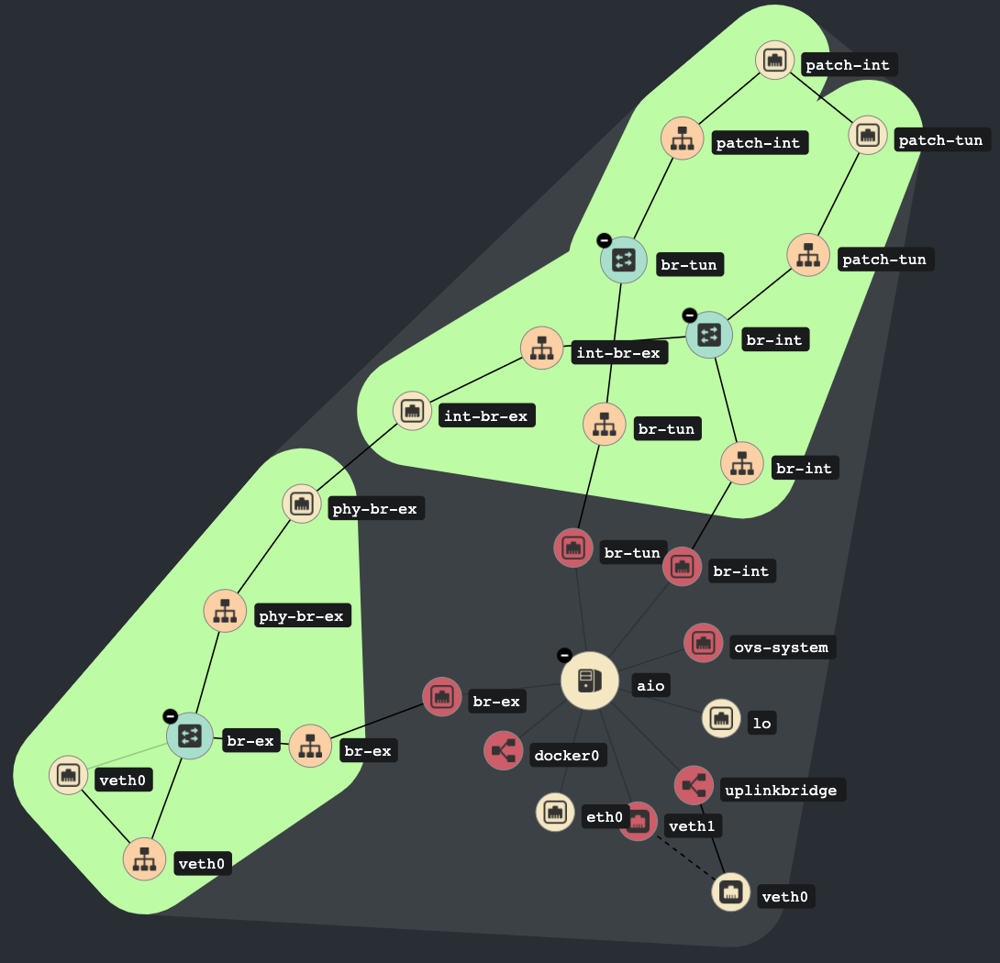

# OpenStack All-in-One Configuration

This configuration was designed to host the OpenStack services in an
[Intel's NUC 10 Perfomance kit][1]. The [provisioning process](../../install.sh)
pulls the official Kolla images and deploys them in a CentOS 7 using the
[undercloud script](../../undercloud.sh).

The following diagram displays the Networking configuration created
by [init-runonce script][2].



## Hardware Details

* 10th Generation Intel® Core™ i5-10210U Processor
* 256 GB NVMe SSD, 1 TB SATA3 HDD
* 16 GB Dual-Channel, LPDDR4-2666

## Vagrant execution

Once Vagrant is installed, it's possible to deploy an OpenStack
cluster on a single Virtual Machine.

```bash
cd samples/aio
vagrant up
```

[1]: https://ark.intel.com/content/www/us/en/ark/products/189239/intel-nuc-10-performance-kit-nuc10i5fnh.html
[2]: https://github.com/openstack/kolla-ansible/blob/10.0.0/tools/init-runonce
