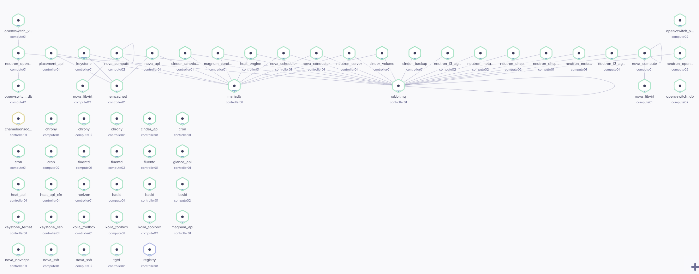

# OpenStack No High Availability Configuration

This configuration was designed to create a minimal OpenStack cluster
using a [Raspberry Pi 4 Model B][1] without High Availability.

The [provisioning process](../../install.sh) is executed on the
Controller node.
It creates a local registry on it using the [registry script](../../registry.sh)
and deploys OpenStack services using the [undercloud
script](../../undercloud.sh).

The following diagram shows the distribution of OpenStack Kolla containers
created by this configuration.

## Hardware Details

- Broadcom BCM2711, Quad core Cortex-A72 (ARM v8) 64-bit SoC @ 1.5GHz
- 4GB or 8GB LPDDR4-3200 SDRAM



## Vagrant execution

Once Vagrant is installed, it's possible to deploy an OpenStack cluster on
Virtual Machines.

```bash
VAGRANT_EXPERIMENTAL=disks vagrant up
vagrant up controller
```

### Environment variables

This table displays the environment variables used to configure some aspects
of the cluster, hardware resources and workflow.

| Name                     | Default | Description                                                                                                   |
| :----------------------- | :------ | :------------------------------------------------------------------------------------------------------------ |
| OS_NUM_COMPUTE_NODES     | 2       | Specifies the number of OpenStack compute nodes                                                               |
| OS_ENABLE_LOCAL_REGISTRY | true    | Determines if a local registry will be deployed on the Controller node. This includes the Kolla build process |
| CPU                      | 4       | Number of vCPUS assigned to the Virtual Machine                                                               |
| MEMORY                   | 8 GB    | Memory assigned to the Virtual Machine (Compute nodes use 4 GB )                                              |

<!-- markdown-link-check-disable-next-line -->

[1]: https://www.raspberrypi.com/products/raspberry-pi-4-model-b/
